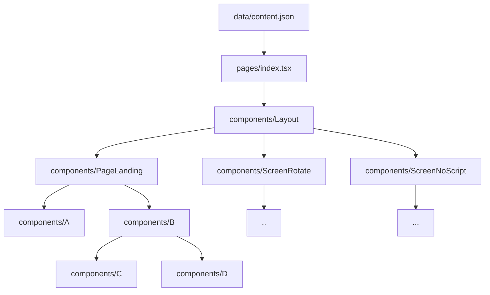

<p align="center">
  <a href="https://terminalizer.com">
    
  </a>
</p>

# Jam3 NextJS Generator


> Boilerplate for React, Static and Server Side Rendered projects with NextJS

> https://generator.jam3.net

> Icon made by Pixel perfect from www.flaticon.com

---

# Table of Contents

- [Installation](#installation)
- [Usage](#usage)
- [File Structure And Organization](#file-structure-and-organization)
- [Copy Management](#copy-management)
- [License](#license)

## &nbsp;

# Installation

## Check your Node and NPM versions

Make sure you are using Node 16.15.1 and NPM 8.11.0 on your development environment to match CircleCI setup. Using NVM is highly encouraged.

```properties
$ nvm install 16.15.1
$ nvm use 16.15.1
```

> TIP: You can deeply integrate into your shell to automatically invoke NVM when changing directories.: https://github.com/nvm-sh/nvm#deeper-shell-integration

### &nbsp;

## Install git-lfs

Download git-lfs by following the steps based on your operating system.

- **Debian / Ubuntu**

  ```properties
  $ curl -s https://packagecloud.io/install/repositories/github/git-lfs/script.deb.sh | sudo bash
  $ sudo apt-get install git-lfs
  ```

- **MacOS (Using Homebrew)**

  ```properties
  $ brew update
  $ brew install git-lfs
  ```

- **Windows**  
  Download and run the latest windows installer from https://github.com/git-lfs/git-lfs/releases.

### &nbsp;

## Set up your linters

In order to save time developing it is highly recommended to have proper linters set up. Below are instructions for VSCode (if you use other editor configure it in a similar way).

- **Install Extensions:**
  - Eslint: https://marketplace.visualstudio.com/items?itemName=dbaeumer.vscode-eslint
  - Prettier: https://marketplace.visualstudio.com/items?itemName=esbenp.prettier-vscode
  - Stylelint: https://marketplace.visualstudio.com/items?itemName=stylelint.vscode-stylelint  
    &nbsp;
- **Configuration:**  
  On MacOS do `cmd + shift + p` > `Open Settings (JSON)`. This will open VSCode's settings.json.  
  Make sure you have the following settings in your settings.json:

  ```json
  {
    "[html]": {
      "editor.defaultFormatter": "esbenp.prettier-vscode"
    },
    "[scss]": {
      "editor.defaultFormatter": "esbenp.prettier-vscode"
    },
    "[json]": {
      "editor.defaultFormatter": "esbenp.prettier-vscode"
    },
    "[javascript]": {
      "editor.defaultFormatter": "esbenp.prettier-vscode"
    },
    "[typescript]": {
      "editor.defaultFormatter": "esbenp.prettier-vscode"
    },
    "[typescriptreact]": {
      "editor.defaultFormatter": "esbenp.prettier-vscode"
    },
    "[jsonc]": {
      "editor.defaultFormatter": "esbenp.prettier-vscode"
    },
    "editor.formatOnSave": true,
    "editor.codeActionsOnSave": {
      "source.fixAll.eslint": true
    },
    "stylelint.validate": ["css", "scss"]
  }
  ```

### &nbsp;

## Clone the GitHub repository

```properties
$ git clone git@github.com:Jam3/prj-3-248-jam3-lab-coding-with-ai-frontend.git
```

### &nbsp;

## Install NPM dependencies:

```properties
$ npm install
```

## &nbsp;

# Usage

## Local Front End server

```properties
$ npm run dev
```

The command above will start the development server on several different ports:

- Frontend (https): https://localhost:3000
- Storybook: http://localhost:9001

## Template scripts

We are using [seng-generator](https://github.com/mediamonks/seng-generator) to generate templates

```properties
# create a simple component
$ npm run generate component [component-name]

# create a page component (the generated files will be automatically prefixed by "Page")
$ npm run generate page [page-name]

# create a new route (use the same name used for generating the page component)
$ npm run generate route [page-name]
```

## &nbsp;

# File Structure And Organization

This is the base folder structure on this project:

```
public/
src/
    assets/
    components/
    data/
    hooks/
    pages/
    services/
    styles/
    svgs/
    utils/
```

In order to make our life easier we have an import alias set up.  
So instead of using relative imports, you can reference the `.src/` folder with an `@/`.  
Example:

```tsx
import log from '@/utils/log'
```

This will import the log util from `./src/utils/log` doesn't matter from where you call it.

It also works inside SCSS files:

```css
src: url('~@/assets/fonts/ShopifySans/ShopifySans-Regular.woff2');
```

## &nbsp;

## Here is the folder breakdown:

## &nbsp;

## public/

```
public/
    favicons/
    images/
    ...
```

This is our static files folder.  
All items in this folder will be copied to the output directory at build time.  
Put here items that need to be publicly accessible and not hashed, like favicons, robots.txt, sitemap, share images, etc.  
If you need to reference them in your code, just use a simple url, like:

```html
<link rel="shortcut icon" href="/common/favicons/favicon.ico" />
```

> **WARNING**: Never import / require files from this folder. This would result in duplicated files in the output directory.

## &nbsp;

## src/assets/

```
src/
    assets/
        fonts/
        images/
        videos/
        ...
```

Here we have all the **binary** assets to be imported / required in our code. Everything inside this folder will be compiled, renamed (hashed), and placed in `/_next/static/` folder at build time. Add here binary files only.

## &nbsp;

## src/components/

```
src/
    components/
        Component/
            MyComponent.module.scss
            MyComponent.stories.js
            MyComponent.tsx
        ...
```

> ”The best way to write big applications is to never write big applications”.

This saying resonates strongly with React.  
Let’s make sure all our components are independent and isolated, in other words, as pure as possible.  
Treat components as individual applications used to compose the final app.  
They should be able to be imported everywhere and should be developed with reusability in mind.

We know sometimes it is hard to keep everything pure. With this in mind our generator produces components that are split into View and Controller components. If you have to, implement any global dependency on the Controller component, leaving the View component pure and testable:

- **View:** A pure and testable component, receives props from the controller
- **Controller:** Handles global state, router, data fetching, etc. Feed and forward props to the view component.

```tsx
// MyComponent.tsx

export interface MyComponentProps {
  className?: string
}

export interface ViewProps extends MyComponentProps {
  loggedIn: boolean
}

// View (pure and testable component, receives props from the controller)
export const View: FC<ViewProps> = ({ className, loggedIn }) => {
  return (
    <div className={classNames('MyComponent', css.root, className)}>
      {loggedIn ? 'You are logged in' : 'You are logged out'}
    </div>
  )
}

// Controller (handles global state, router, data fetching, etc. Feeds props to the view component)
const MyComponent: FC<MyComponentProps> = (props) => {
  const [loggedIn] = localStore((state) => [state.loggedIn], shallow)
  return <View {...props} loggedIn={loggedIn} />
}

export default memo(MyComponent)
```

Let's follow some practices in order to make our life easier:

- ### **Keep components as decoupled as possible.**

  - It means to avoid global scoped dependencies like Router, Redux, Zustand, or any global state wiring in the **View** components, use the **Controller** component for that.

  - In the **View** components everything should come in as props, and out as callbacks. Consider each component as an isolated application.

  With this structure you will be able to create Storybook stories and test the View component with ease:

  ```tsx
  // MyComponent.stories.tsx

  import { View, ViewProps } from './MyComponent'

  export default { title: 'components/MyComponent' }

  export const LoggedIn: Story<ViewProps> = (args) => <View {...args} />
  LoggedIn.args = { loggedIn: true }

  export const LoggedOut: Story<ViewProps> = (args) => <View {...args} />
  LoggedOut.args = { loggedIn: false }
  ```

### &nbsp;

- ### **Avoid components namespacing.**

  Let’s keep all of our components in the same folder (`src/components`) and avoid creating subfolders like `src/components/buttons/Accept`, `src/components/modals/Accept`, etc. This will give us visibility of all components and prevent components with the same name to be created inadvertently.  
  Instead, let’s group similar components by prefixing them, so they appear grouped in the `src/components`.  
  Examples: `ButtonAccept`, `ButtonRound`, `ButtonXYZ`, `Carousel`, `CarouselItem`, `ModalAccept`, etc…

### &nbsp;

- ### **Common style structure.**

  Let’s make sure to always implement our component styling in a predictable way:

  ```tsx
  // MyComponent.tsx

  import css from '#/css/components/MyComponent/MyComponent.module.css'

  ...
  export const View: FC<ViewProps> = ({ className, ... }) => {
    return (
      <div className={classNames('MyComponent', css.root, className)}>
        ...
      </div>
    );
  };
  ...
  ```

  And in our MyComponent.module.scss files:

  ```scss
  // MyComponent.module.scss

  @import 'shared';

  .root {
    ...
  }
  ```

  This pattern give us 2 immediate advantages:

  - By having a string class name with the same name of the component (`'MyComponent'`), we are able to query children components with ease. This is specially useful when we start to implement animations. This hardcoded string class name should be only used for DOM selection purposes, though, never for styling.
  - By having the CSS module `css.root` class, we create a good standard by signaling the top-most class in every component. This will also compile nicely to something like `MyComponent__root__xyzw`, making our life easier when we have to debug.

### &nbsp;

- ### **Stories are important.**

  Let’s make sure all components have Storybook stories with proper controls set up.  
  It is not only important for testing but also works as documentation for other developers.  
  This way we can easily check how components works and if they fit our needs in a particular scenario, preventing us from creating several similar components unnecessarily, and even more important, allowing us to make changes to any specific component directly without having to, for instance, launch the entire project, navigate to a specific page, add some flags or comment chunks of code, and so on just for checking how a single component works. In the end, having good stories speeds up the development (specially towards the QA/end phases of a project).

## &nbsp;

## src/data/

```
src/
    data/
        content.json
        config.json
        types.ts
        ...
```

Here we have our configuration and string content.  
These files will be consumed at build time to populate our pages.  
Never import content.json directly inside components as it might make it harder to switch to a CMS in the future.
Page components should receive the required strings through Next.js `getStaticProps()` method.

See [Copy Management](#copy-management) section below for more details.

## &nbsp;

## src/hooks/

```
src/
    hooks/
        use-layout.ts
        use-window-size.ts
        ...
```

Add here any custom React hook you might need. We have several useful hooks already implemented, check them out on.

## &nbsp;

## src/pages/

```
src/
    pages/
        _app.tsx
        _document.tsx
        index.tsx
        ...
```

Here we have all the Next.js routing logic.  
It was separated from the React components logic on purpose. Here are the main reasons:

- **A better separation of concerns.** Next.js logic will most times be executed in the NodeJS context, not the browser's. And this very often leads to confusion.
- **Prevents route pollution.** Next.js by default looks for every file inside this folder to generate the routing logic. By separating it from the components we are now able to have proper naming convention for our pages, and have storybook stories of our pages without the risk of generating unwanted routes.
- **Flexibility.** Depending on our needs we might have to, for instance, render different components for the same route (issue often found phased projects). By having the Next routing logic separated from the React components logic we can easily achieve this and much more.

## &nbsp;

## src/services/

```
src/
    services/
        raf.ts
        resize.ts
        ...
```

If you ever worked with Angular this will be strightforward to you.  
A service is typically a class with a narrow, well-defined purpose. It should do something specific and do it well.  
In this project, services are [singleton](https://refactoring.guru/design-patterns/singleton) class instances that abstract, and prevent, the need of adding several event listeners for the same browser events, like resize, requestAnimationFrame, etc. Consider using services for events that are prone to be listened by many components.

## &nbsp;

## src/styles/

```
src/
    styles/
        fonts.scss
        global.scss
        mixins.scss
        ...
```

Global [SASS](https://sass-lang.com/) stuff.

## &nbsp;

## src/svgs/

```
src/
    svgs/
        ArrowLeft.svg
        Logo.svg
        ...
```

Since SVGs are not binary assets, they are code that generate GIT diffs and can be used in several scenarios other than just rendering some graphics on the screen. They are like another class of application components, like hooks and services are.  
In the end of the day they are most often compiled through [SVGR](https://react-svgr.com/) to be imported and used like regular components, but, are not able to perform imports and don't have any associated style file.  
Also, they don't follow same file and code structure as components, and they don't require individual folders.  
For these reasons they have this special folder instead of being placed inside `assets/` or `components/` folders.  
Storybook-wise, we have a special file (`.storybook/intro/Svg.stories.tsx`) that automaticaly creates a catalog of all SVGs placed here.

## &nbsp;

## src/utils/

```
src/
    utils/
```

Our beloved utility belt.

## &nbsp;

# Copy Management

## A single source of truth: `./src/data/content.json`

A very good practice is to have all content grouped in a single source of truth. This allow us to change them quickly and prevents wasting time hunting individual copies through components when we need to make adjustments.  
Also, it allows us to send the entire json file for translation or corrections when required, making our life easier and more organized in the end of the day. Switching to a CMS in the future will also be much easier, since we will most likely just need to change the data source.

## Copy injection flow

That is why it is important to **never** import content.json inside our components. Instead, import it in your route files (`./src/pages/*`) and inject only the required content through the `getStaticProps()` method.

For instance, considering this content on `content.json`:

```json
{
  "common": {
    "play": "play",
    "pause": "pause",
    "close": "close",
    "screenRotate": {
      "title": "Please rotate\nyour device"
    }
  },
  "pageLanding": {
    "head": {...}
    },
    "body": {
      "title": "Landing Page"
    }
  }
}

```

We could inject the copy this way inside our route file:

```tsx
import { GetStaticProps } from 'next'

import strings from '@/data/content.json'

import PageLanding, { PageLandingProps } from '@/components/PageLanding/PageLanding'

export const getStaticProps: GetStaticProps<PageLandingProps> = async () => {
  return {
    props: {
      head: strings.pageLanding.head,
      common: strings.common,
      strings: strings.pageLanding.body
    }
  }
}

export default PageLanding
```

Note the PageLanding component will receive only the pageLanding content as props.
It will then forward the received content to child components. This allow us to have a single entry point for all the copy that can be easily changed in the future to a CMS or any other data source.



## &nbsp;

## Powerful copy with less typing!

We have a very useful util for handling copy at `@/utils/copy.ts`. It facilitates content handling, performs xss cleanups and allows us to interpolate values on every string. For example, lets consider we have this copy in our content.json:

```json
{
  "hello": "Hi! {name}!\nHow are you?\nFancy for a {meal}?"
}
```

We could implement it inside our components like:

```html
<h1 {...copy.html(content.hello, {name: 'John Doe', meal: 'drink'})} />
```

It would result in something like:

```html
<h1 dangerouslySetInnerHTML={{ __html: 'Hello John Doe!<br />How are you?<br />Fancy for a drink?' }} />
```

Check the `./src/utils/copy.ts` implementation for more details.

## &nbsp;

# License

[MIT](LICENSE)
