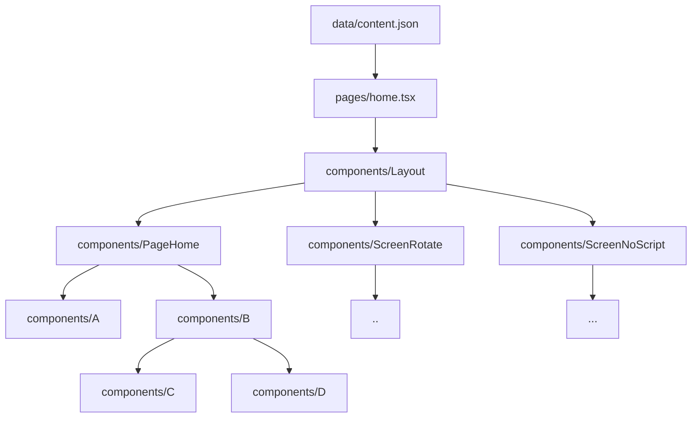

# Copy Management: Keeping Your Content Organized and Flexible

Hey there, content wrangler! 👋 Let's dive into how we manage copy in our project. It's all about keeping things organized, easy to update, and future-proof.

## The Single Source of Truth: `./src/data/content.json`

Think of `content.json` as the book of wisdom for your app. It's where all your copy lives. Why do we love this approach? Let me count the ways:

- 🚀 Need to update content? It's quick and easy!
- 🌍 Translations or corrections? Send one file, and you're done.
- 🔮 Future-proofing: Switching to a CMS later? No problem!

## The Copy Injection Flow: A Three-Step Dance

To keep our app tidy and our content manageable, we follow these steps:

1. 🚫 **Never** import `content.json` directly into components. It's tempting, but resist!
2. 📥 Instead, import it in your route files (`./src/pages/*`).
3. 💉 Use the `getStaticProps()` method to inject the content you need.

### Let's See It in Action!

Imagine we have this `content.json`:

```json
{
  "common": {
    "screenRotate": {
      "title": "Please rotate\nyour device"
    },
    "screenNoScript": {
      "title": "Please enable\nJavaScript"
    }
  },
  "pages": {
    "home": {
      "head": {
        "title": "Home"
      },
      "body": {
        "title": "Welcome to Monks!"
      }
    }
  }
}
```

Here's how we'd use it in a route:

```tsx
import type { PageHomeProps } from '@/components/PageHome'
import type { GetStaticProps } from 'next'

import { CmsService } from '@/services/cms.service'

export const getStaticProps: GetStaticProps<PageHomeProps> = async () => {
  return {
    props: {
      content: CmsService.getPageContent('home')
    }
  }
}

export { PageHome as default } from '@/components/PageHome'
```

Cool, right? This way:

- 🎯 We have one source for all content.
- 📦 Only the necessary content goes to the page components.
- 🔄 Switching to a CMS later? Easy peasy!

### The Content Journey: A Visual Tale



## Copy Handling: The Smart Way

Our `@/utils/copy.ts` utility is like a Swiss Army knife for content. It:

- 🧹 Keeps content handling neat and tidy.
- 🛡️ Protects against XSS attacks.
- 🔀 Lets you mix in dynamic values with your strings.

### Try It Out!

Let's say you have this in your `content.json`:

```json
{
  "hello": "Hi! {name}!\nHow are you?\nFancy for a {meal}?"
}
```

Use it in your component like this:

```jsx
<h1 {...copy.html(content.hello, { name: 'John Doe', meal: 'drink' })} />
```

And voilà! It's the same as writing:

```jsx
<h1 dangerouslySetInnerHTML={{ __html: 'Hello John Doe!<br />How are you?<br />Fancy for a drink?' }} />
```

Want to know more? Check out `./src/utils/copy.ts`.
