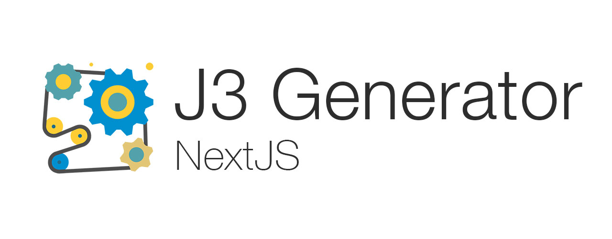

<p align="center">
  <a href="https://terminalizer.com">
    
  </a>
</p>

# Jam3 NextJS Generator


> Boilerplate for React, Static and Server Side Rendered projects with NextJS

> https://generator.jam3.net

> Icon made by Pixel perfect from www.flaticon.com

---

# Table of Contents

- [Installation](#installation)
- [Usage](#usage)
- [Release](#release)
- [Developers](#developers)
- [Contributing](#contributing)
- [License](#license)

---

## Installation

### Check your Node and NPM versions

Make sure you are using Node 14.x.x and NPM 7.x.x on your development environment. Using NVM is highly encouraged.

```properties
nvm use 14
npm install --global npm@7
```

> TIP: If you use ZSH, you can configure automatic Node switching: <https://kinduff.com/2016/09/14/automatic-version-switch-for-nvm/>

### Clone the GitHub repository

Or Fork it, and start working right away with it.

```properties
git clone https://github.com/Jam3/nyg-nextjs.git
```

### CI/CD

#### Setup

After setting up terraform to provision our infrastructure, use the terraform AWS variables and add them as secrets to this repo as:

- AWS_SECRET_ACCESS_KEY_DEV
- AWS_ACCESS_KEY_ID_DEV

#### Usage

Handled by Github Actions

- linters check will run on every PR
- deployment will run on approved PRs to develop

## Usage

#### 1. local Front End server

```properties
# http://localhost:3000
$ npm run dev
```

#### 2. storybook

```properties
# http://localhost:9001
$ npm run storybook
```

#### 3. template scripts

We are using [seng-generator](https://github.com/mediamonks/seng-generator) to generate templates

```properties
# cli
$ npm run generate

# create page(s)
$ npm run generate page [page-name]

# create api routes
$ npm run generate api [api-name]

# create component
$ npm run generate component [component-name]
```

Default location can be edited here:

- [page](scripts/templates/page/.senggenerator)
- [component](scripts/templates/component/.senggenerator)
- [api](scripts/templates/api/.senggenerator)

### 4. Autofix lint error

You can run the following to fix all linter errors eg. import orders.

```properties
# cli
npm run lint -- --fix

## Release

To releasing new versions we are using [standard-version](https://github.com/conventional-changelog/standard-version).

Steps:

1. When PRs/commits land to your master branch, select the Squash and Merge option.
2. Add a title and body that follows the [Conventional Commits Specification](https://www.conventionalcommits.org).
3. Run `$ git checkout master; git pull origin master`
4. Run `$ npm run release`
5. Run `$ git push --follow-tags origin master`

---

## Developers

- List
- Your Names here

---

## Contributing

Please read [CONTRIBUTING.md](CONTRIBUTING.md) for details on our code of conduct, and the process for submitting
pull requests.

---

## License

[MIT](LICENSE)
```
